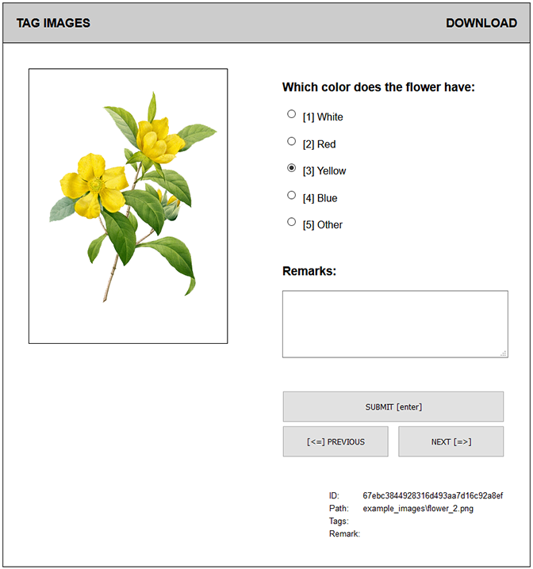

# Image Tagging

This project provides a simple Flask webservice for tagging image files.

## Getting Started

To install the tagging server, simply clone the code into your working directory. Then
install its requirements by typing:

```bash
pip install -r requirements.txt
```

Once the environments are installed, you can start using the tagging server. The example
provides a simple setup for you to experiment with.

## Example

To run the example, type:

```bash
python tagserver.py -c example_config.yaml
```

This should open a browser window that looks like this:



If no browser opens, try browsing to <http://127.0.0.1:8080/> yourself.

### Navigation

You can use the mouse to navigate the tagging webpage, but it may be quicker to use the
keyboard shortcuts. The interface provides the following shortcuts:

| Key | Action |
|---|---|
| Left arrow | Go to previous image |
| Right arrow | Go to next image |
| Enter | Submit tagging data |

In addition, you can specify shortcut keys for the tags in the configuration file. The
example defines the following shortcuts:

| Key | Action |
|---|---|
| 1 | Select "White" tag |
| 2 | Select "Red" tag |
| 3 | Select "Yellow" tag |
| 4 | Select "Blue" tag |
| 5 | Select "Other" tag |

### Finished Tagging

Once you finish tagging images, simply close the browser window; all your progress has
been stored into the SQLite tags database (located at: 'example_output/image_tags.db).
You continue at any time by simply starting the tagging server again.

To kill the Flask server, press `CTRL + C` on the command line where you started the
server from.

## Configuring the Server

Now that you have seen the example, let's have a look at configuring the server for your
own project. This requires the following steps:

### 1. Put input images into a folder

Create a subfolder in the server folder and put your images into it. The sever should
have read permissions on the image folder, or it will not be able to find and
display your images.

### 2. Update configuration

Create a `config.yaml` for your project; the easiest way is copy and adjust the provided
`example_config.yaml`. Make sure you check at least these entries:

- images:
  - path: Set the path to the image files (see step 1).
  - types: List of image types (extensions) to include in the search.

- database:
  - path: Location of the tags database; always start a project with a new database!

- tagging:
  - tag question: Sets the question above the tags.
  - tags: Tags and thier shortcut keys, format `<tag>: <key>`.

These settings will probably change with every project, so make sure they are set
correctly!

### 3. Start the server

Start the Flask server by typing:

```bash
python tagserver.py -c <config_file>
```

Replace `<config_file>` with the name of your project's configuration file.

### Adding or removing images

You can always add images to the input folder; once you restart the tagging server it
should automatically find and include the new images.

Removing or moving images is a bit more problematic; this will corrupt the database, so
this can break the interface. Best is to not delete the images or otherwise restart the
project (i.e. remove the database file).

## TO DO

This project is very much work in progress; feel free to get involved! Some features
that would be nice to have:

- Better handling of (re-)moving image files; option to clean the database.
- Validation of the form input (e.g. select at least 1 tag).
- Enable / disable skipping images.
